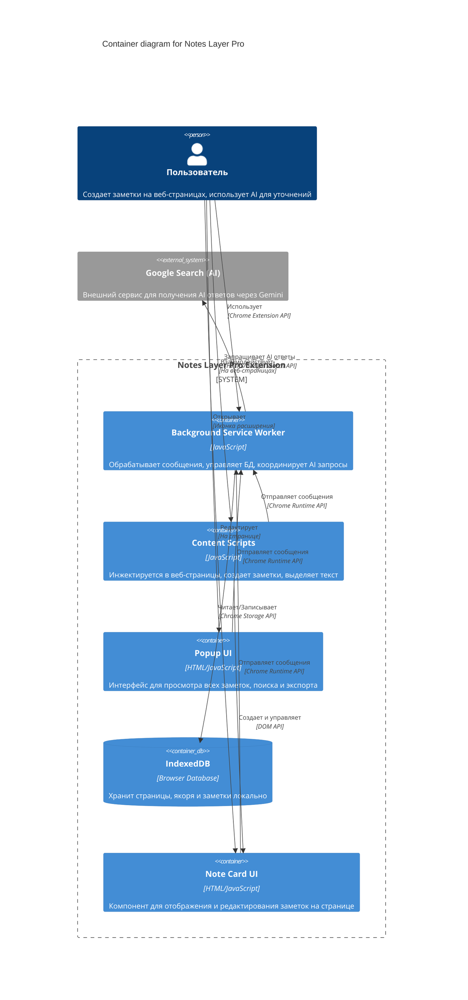

# C4 Diagram: Notes Layer Pro - Container Diagram

## Описание контейнеров

### Background Service Worker
- **Технология**: JavaScript (ES6 Modules)
- **Ответственность**: 
  - Обработка сообщений от content scripts и popup
  - Управление IndexedDB через db.js
  - Координация AI запросов через GoogleSearchProvider
  - Управление контекстным меню
  - Экспорт данных в JSON

### Content Scripts
- **Технология**: JavaScript (ES6 Modules)
- **Ответственность**:
  - Инициализация на веб-страницах
  - Создание заметок из выделенного текста
  - Восстановление заметок при загрузке страницы
  - Управление выделениями текста (Highlighter)
  - Создание якорей для заметок (AnchorManager)
  - Отображение превью заметок при наведении

### Popup UI
- **Технология**: HTML/CSS/JavaScript
- **Ответственность**:
  - Отображение списка всех страниц с заметками
  - Поиск по заметкам
  - Удаление страниц и заметок
  - Экспорт данных в JSON
  - Перезагрузка расширения

### IndexedDB
- **Технология**: Browser IndexedDB API
- **Ответственность**:
  - Хранение страниц (pages)
  - Хранение якорей (anchors)
  - Хранение заметок (notes)
  - Поддержка индексов для быстрого поиска

### Note Card UI
- **Технология**: HTML/CSS/JavaScript (Quill Editor)
- **Ответственность**:
  - Отображение карточки заметки на странице
  - Редактирование заметок (аннотации, вопросы)
  - Запрос AI ответов
  - Удаление заметок
  - Перепривязка заметок к новому тексту

### Google Search (AI)
- **Технология**: Внешний веб-сервис
- **Ответственность**:
  - Предоставление AI ответов через Gemini
  - Обработка вопросов пользователя

## Технологии

- **Frontend**: Vanilla JavaScript (ES6 Modules), HTML5, CSS3
- **Database**: IndexedDB (Browser API)
- **Editor**: Quill.js (Rich Text Editor)
- **Extension API**: Chrome Extensions Manifest V3
- **AI Integration**: Google Search AI (Gemini) через веб-скрапинг
